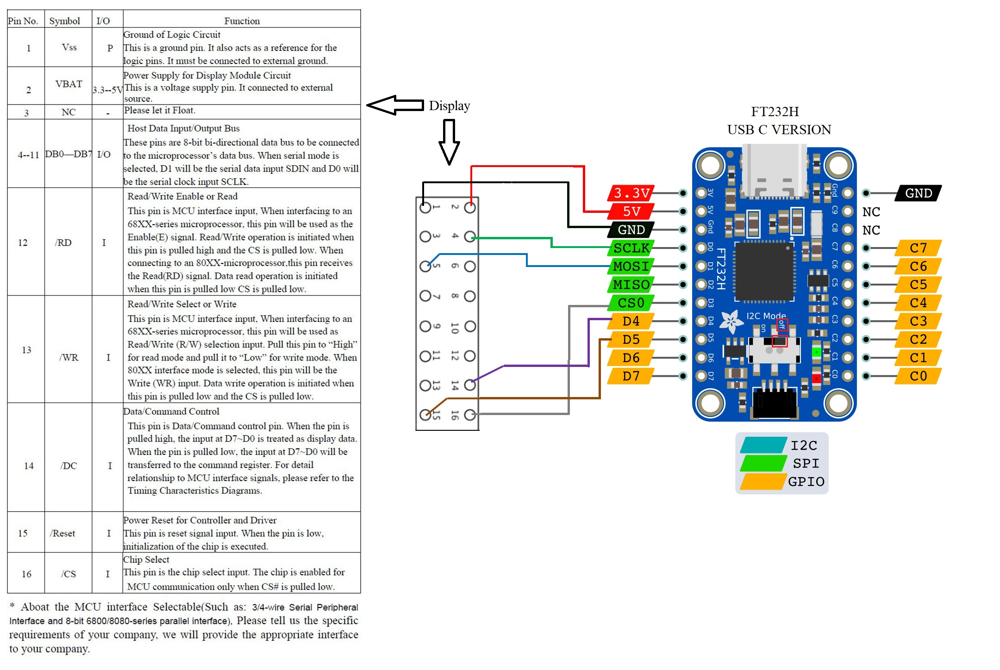

# Using the Adafruit FT232H with luma-oled on SSD1322

## how to wire
<div align="center">
  <br>
</div>

```
sudo apt-get install libusb-1.0 -y
pip3 install pyftdi
```

`sudo nano /etc/udev/rules.d/11-ftdi.rules

enter:
```
# /etc/udev/rules.d/11-ftdi.rules
SUBSYSTEM=="usb", ATTR{idVendor}=="0403", ATTR{idProduct}=="6001", GROUP="plugdev", MODE="0666"
SUBSYSTEM=="usb", ATTR{idVendor}=="0403", ATTR{idProduct}=="6011", GROUP="plugdev", MODE="0666"
SUBSYSTEM=="usb", ATTR{idVendor}=="0403", ATTR{idProduct}=="6010", GROUP="plugdev", MODE="0666"
SUBSYSTEM=="usb", ATTR{idVendor}=="0403", ATTR{idProduct}=="6014", GROUP="plugdev", MODE="0666"
SUBSYSTEM=="usb", ATTR{idVendor}=="0403", ATTR{idProduct}=="6015", GROUP="plugdev", MODE="0666"
```

Test and find ftdi device:
start `python3
```
from pyftdi.ftdi import Ftdi
Ftdi().open_from_url('ftdi:///?')
```
should output: 'ftdi://ftdi:232h:1/1'
if not change var device='ftdi://ftdi:232h:1/1'

